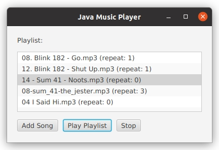

# Java Music Player Feature

This project is a simple Java standalone music player with a unique feature that makes it different from other players.

The key idea is **custom repeat/skip control in the playlist**, and also to use this desktop demonstration as a starting point for <u>later forking or adapting an open-source Android music player</u>, so the same concept can eventually run on a phone.

* Each song in the playlist has a **repeat count**.
* If the repeat count is set to **0**, the song will be skipped during playback, but it will **not be removed** from the playlist.
* If the repeat count is set to **N > 0**, the song will be played **N times in a row** before moving on to the next track.

:fire: This way, the playlist can be adapted to the listener’s mood without deleting or permanently modifying it. Songs you don’t feel like hearing can be skipped, while favorites can play multiple times, all within the same playlist session.

---

### Future Enhancement: Mood Tags
Another feature idea is to allow **mood-based playlist tags**.  
You could mark each playlist with one or more *mood tags* (for example: `chill`, `energetic`, `focus`).  
When starting playback, you’d select a mood, and the app would automatically load the repeat/skip settings that match that mood—so you don’t have to manually tweak repeat counts every time your mood changes.

---

### Basic UI Demo
As a basic working demonstration, a simple JavaFX UI window has been created:



---

### How to Run

Make sure you have **Java 21** installed, then run:

```bash
mvn clean javafx:run
